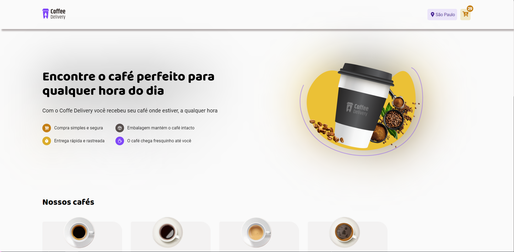
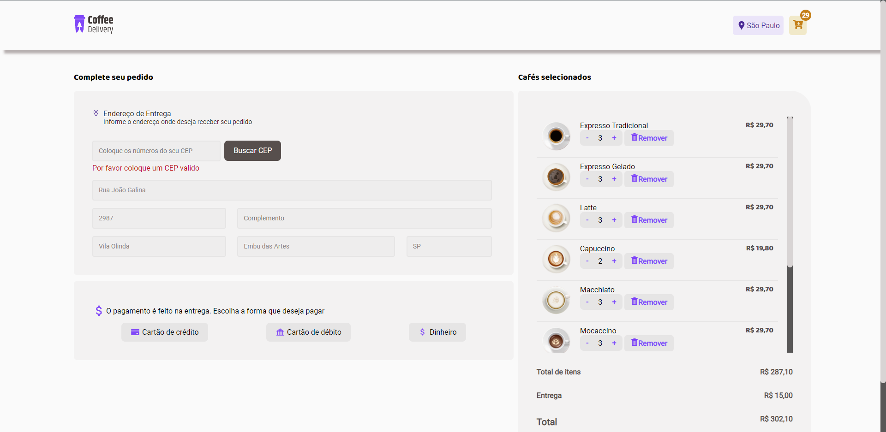
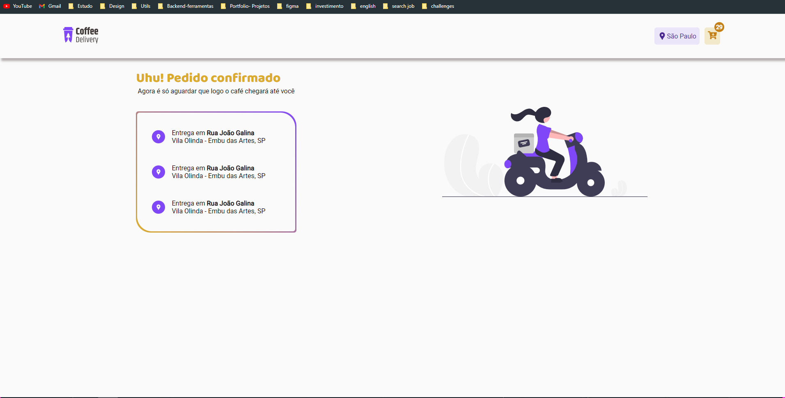

<h1 align="center">
    
</h1>
  
  Coffee delivery is an application to sell coffee , this [documentation](https://efficient-sloth-d85.notion.site/Desafio-02-Coffee-Delivery-30e42a21fdb44b09a85244fc2c3dbdf9) explains more about this challenge

 <h2>&#128396; Figma</h2>
  <p>Link: <a> https://www.figma.com/file/eoBLlrTBrjSwUuLoiqmmjd/Coffee-Delivery-(Copy)?type=design&t=mLHh0lTjoJUcVorh-0</a></p>
 <h2>:computer: Web Application</h2>

 <h3>Home</h3>
<hr>
 
 <hr>
<h3>Checkout</h3>
 
<hr>
<h3>Success</h3>
 
<hr>

<h2> :bulb: Functionalities</h2>

* List available coffees;

* Add products to cart 

* Increase or remove the quantity of items in the cart

* Search address for user CEP

* Show the quantity of items in header cart

* Save date in local storage

<h2> :wrench: Prerequisites</h2>

 Before you start, you need to install the following tools on your machine:
[Git](https://git-scm.com), [Node.js](https://nodejs.org/en/). Also, it's good to have an editor to work with code like [VSCode](https://code.visualstudio.com/)

:rocket: To run the application

  ```bash

# Clone este repositório
$ git clone https://github.com/Gabriel52/CoffeDelivery

# Acesse a pasta do projeto no seu terminal/cmd
$ cd CoffeDelivery

# Execute o comando na pasta coffeeDelivery para instalar todas as dependências
$ npm install ou yarn

# Execute o comando para rodar o banco de dados
$ npm run database:start


# Execute a aplicação em modo de desenvolvimento, é importante executar este comando
$ npm run dev ou yarn dev

# A aplicação web será aberta na porta:3000 - acesse http://localhost:3000

 ```

## 🛠 Tecnologias
* React JS
* Typescript
* Axios
* Json-server
* Context api
* Styled components

<h2> :book: License </h2>
<p>Released in 2023 :book:</p></br>
<p>Made by Gabriel Brune :rocket:. This project is under the MIT license</p></br>
<p>Give a :star: if this project helps you</p>

<h2> 🐛 Problems</h2
<p>Feel free to file a new issue with its title and description in the Ignite challenge repository. If you've already found a solution to your problem, I'd love to review your pull request!</p>
